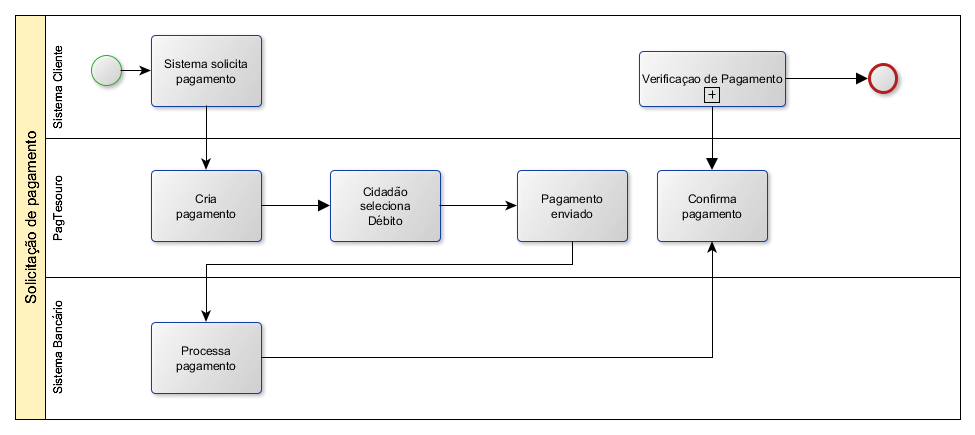
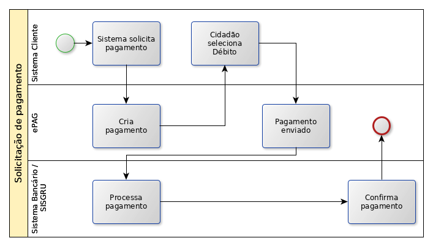
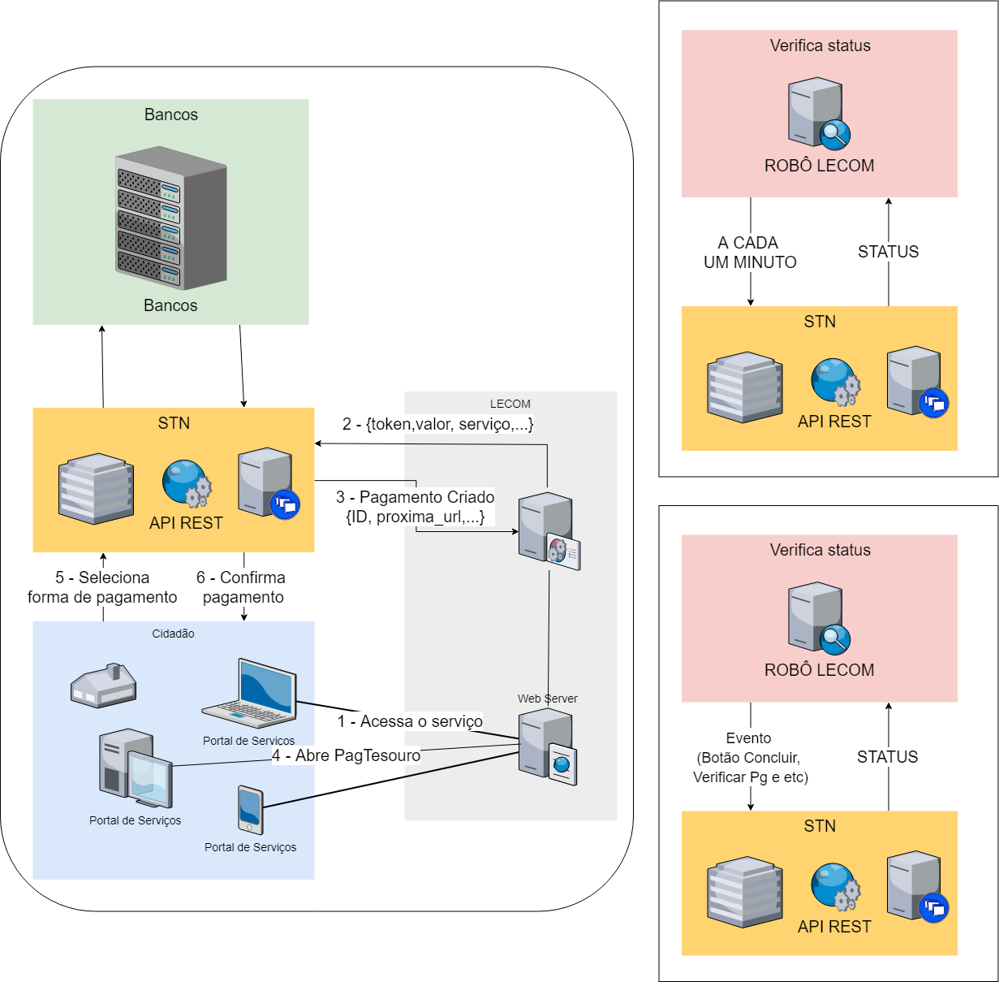
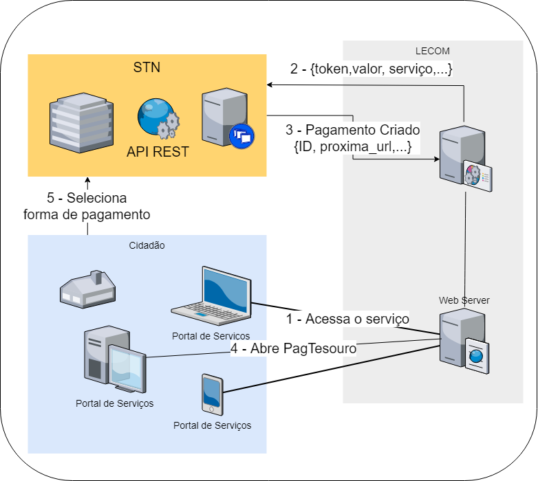

Apresentação
============

PagTesouro
**********

O PagTesouro é o serviço em construção do governo federal para diponibilizar 
meios de pagamentos de boleto, débito online e cartão de crédito para pagamentos. Essa documentação é baseada na versão 1.7 da documentação do PagTesouro (https://v-epag.estaleiro.serpro.gov.br/simulador/#/pages/api)

Formas de uso
*************

É possível usar de duas formas:

* Débito online
* Boleto bancário

.. important::
    Os meios de débito online e boleto estão prontos na **primeira versão** do sistema e será desenvolvido em versão futura o cartão de crédito, débito e pagamento instantâneo.

Fluxo do débito online do Banco do Brasil
*****************************************

É necessário que o sistema cliente solicite o pagamento e que verifique se o pagamento foi de fato realizado.

.. important::
    Outras instituições financeiras devem estar habilitadas a partir de setembro - outubro de 2020.

Solicitação de pagamento
------------------------

.. attention::
   O atrinuto proxima_url expira em 60 minutos e não pode ser utilizado nos status (CONCLUIDO, REJEITADO, CANCELADO).

Verificação de pagamento
------------------------

.. image:: _imagens/fluxo_verificacao_debito.png
   :scale: 75 %
   :align: center
   :alt: Fluxo simplificado de verificação de pagamento para débito online.
   
O processo de verificação do status do pagamento inicia ou por tempo ou por evento.

Fluxo do boleto bancário
************************

Solicitação de pagamento
------------------------

.. attention::
   O PagTesouro só solicita a criação do boleto bancário. O **idPagamento** não é associado ao pagamento do boleto.
   É necessário o órgão verificar o pagamento.
   
.. attention::
   O atrinuto proxima_url expira em 60 minutos e não pode ser utilizado nos status (CONCLUIDO, REJEITADO, CANCELADO).

Fluxo do cartão de crédito
**************************

Não há possibilidade de cartão de crédito nessa versão do PagTesouro.

Fluxo do cartão de débito
*************************

Não há possibilidade de cartão de débito nessa versão do PagTesouro.

Fluxo de pagamento instantâneo
******************************

Não há possibilidade de pagamento insntantâneo nessa versão do PagTesouro.

Exemplo de Integração 
*************************

Ferramenta de Automação Federal (LECOM) e PagTesouro - DÉBITO ONLINE
------------------------

O processo de verificação do status do pagamento acontece de duas formas: por tempo ou por evento. 

.. important::
    A solicitação de criação do pagamento é feita pelo backoffice da ferramenta de automação, então os parâmetros (token, valor, serviço e etc) devem estar configurados nesse backoffice.

Ferramenta de Automação Federal (LECOM) e PagTesouro - BOLETO
------------------------

O processo de verificação do status do pagamento do boleto é feito a parte pelo órgão.

.. important::
    A solicitação de criação do pagamento é feita pelo backoffice da ferramenta de automação, então os parâmetros (token, valor, serviço e etc) devem estar configurados nesse backoffice.

Informar ao cidadão sobre o pagamento
*************************************

Pode informar por e-mail ou por SMS.

Caso seja desejado pode-se entrar em contato com o Ministério da Economia para
utilizar a plataforma de SMS para envio de mensagem ao cidadão e informá-lo
sobre a situação do pagamento.
