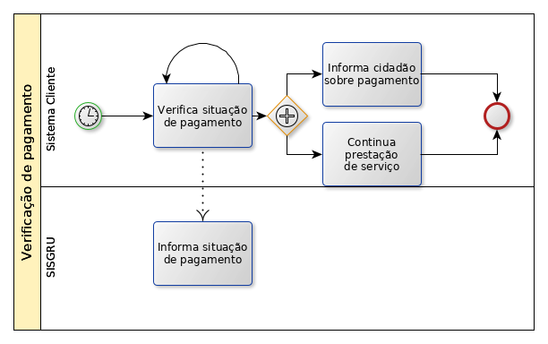

Apresentação
============

PagTesouro
****

O PagTesouro é o serviço em construção do governo federal para diponibilizar meios de pagamentos de boleto, débito online e cartão de crédito para pagamentos.

Formas de uso
*************

É possível usar de duas formas:

* Débito online
* Boleto bancário

.. important::
    Os meios de débito online e boleto estão prontos na primeira versão do sistema e será desenvolvido em versão futura o cartão de crédito.
    

Fluxo do débito online
*************************

É necessário que o sistema cliente solicite o pagamento e que verifique se o pagamento foi de fato realizado.

Solicitação de pagamento
------------------------

.. image:: _imagens/fluxo_debito.png
   :scale: 100 %
   :align: center
   :alt: Fluxo simplificado da solicitação para débito online.

Verificação de pagamento
------------------------

.. image:: _imagens/fluxo_verificacao_debito.png
   :scale: 100 %
   :align: center
   :alt: Fluxo simplificado de verificação de pagamento para débito online.

.. attention::
   Não há, até a versão 1.1 do Manual, alguma API para verificar se o pagamento foi realizado.
   É **necessário** uma **verificação humana manual** para tal.

Fluxo do boleto bancário
************************

Solicitação de pagamento
------------------------

.. image:: _imagens/fluxo_boleto.png
   :scale: 100 %
   :align: center
   :alt: Fluxo simplificado do solicitação para boleto bancário.

.. attention::
   O ePAG só solicita a criação do boleto bancário. O **idPagamento** não é associado ao pagamento do boleto.
   É necessário pesquisar no SISGRU se o pagamento de fato ocorreu.

Verificação de pagamento
------------------------

.. danger::
  O ePAG só solicita a criação do boleto bancário. O **idPagamento** não é associado ao pagamento do boleto.
  É necessário pesquisar no SISGRU se o pagamento de fato ocorreu.

Informar ao cidadão sobre o pagamento
*************************************

Caso seja desejado pode-se entrar em contato com o Ministério da Economia para
utilizar a plataforma de SMS para envio de mensagem ao cidadão e informá-lo
sobre a situação do pagamento.

Fluxo do cartão de crédito
**************************

Não há possibilidade de cartão de crédito nessa versão do ePAG.

Exemplo de Integração 
*************************

Ferramenta de Automação Federal (LECOM) e PagTesouro - DÉBITO ONLINE
------------------------

.. image:: _imagens/fluxo_geral.png
   :scale: 50 %
   :align: center
   :alt: Fluxo geral do pagamento.

O processo de verificação do status do pagamento acontece de duas formas: por tempo ou por evento.

.. important::
    A a solicitação de criação do pagamento é feita pelo backoffice da ferramenta de automação, então os parâmetros (token, valor, serviço e etc) devem estar configurados nesse backoffice.
    
Ferramenta de Automação Federal (LECOM) e PagTesouro - BOLETO
------------------------

