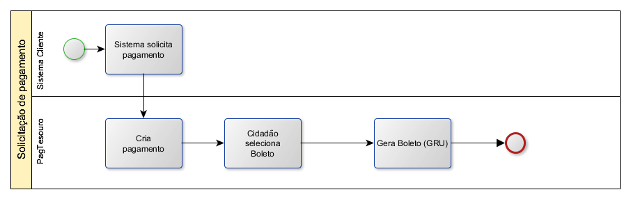

Apresentação
============

ePAG
****

O ePAG é o serviço em construção do governo federal para diponibilizar meios de pagamentos de boleto, cartão de débito e cartão de crédito para pagamentos.

Formas de uso
*************

É possível usar de duas formas:

* Cartão de débito
* Boleto bancário

.. important::
    Os meios de cartão de débito e boleto estão prontos na primeira versão do sistema e será desenvolvido em versão futura o cartão de crédito.

Fluxo do cartão de débito
*************************

É necessário que o sistema cliente solicite o pagamento e que verifique se o pagamento foi de fato realizado.

Solicitação de pagamento
------------------------

Verificação de pagamento
------------------------

.. image:: _imagens/fluxo_verificacao_debito.png
   :scale: 100 %
   :align: center
   :alt: Fluxo simplificado de verificação de pagamento para cartão de débito.

.. attention::
   A verificação de pagamento através do cartão de débito pode ser informado via
   callback ou ser pesquisado via **idPagamento**.

Fluxo do boleto bancário
************************

Solicitação de pagamento
------------------------

.. attention::
   O ePAG só solicita a criação do boleto bancário. O **idPagamento** não é associado ao pagamento do boleto.
   É necessário pesquisar no SISGRU se o pagamento de fato ocorreu.

Verificação de pagamento
------------------------

.. danger::
  O ePAG só solicita a criação do boleto bancário. O **idPagamento** não é associado ao pagamento do boleto.
  É necessário pesquisar no SISGRU se o pagamento de fato ocorreu.

Fluxo do cartão de crédito
**************************

Não há possibilidade de cartão de crédito nessa versão do ePAG.

Informar ao cidadão sobre o pagamento
*************************************

Caso seja desejado pode-se entrar em contato com o Ministério da Economia para
utilizar a plataforma de SMS para envio de mensagem ao cidadão e informá-lo
sobre a situação do pagamento.
