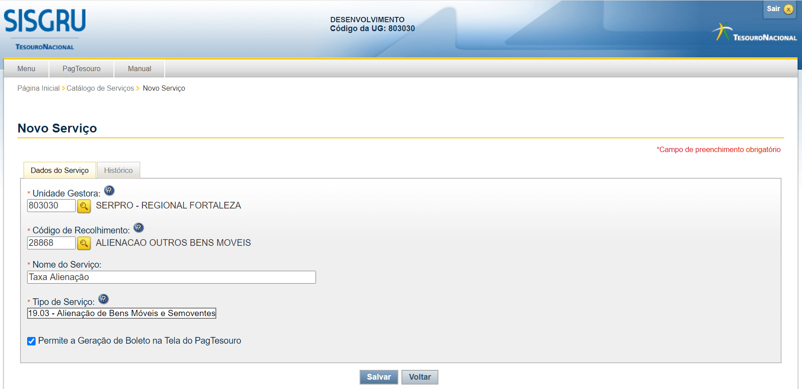

Passo a passo para utilizar a plataforma ePAG
*********************************************

Para integrar um serviço público com a plataforma ePAG é necessário executar alguns passos:

1. Cadastre seu serviço no SISGRU:
----------------------------------
Um requisito para integrar é ter seu serviço cadastrado na SISGRU.

**Como fazer:**
Solicite para o representante do órgão no Rede SERPRO sua senha caso você não tenha. Após isso solicite a STN acesso ao SISGRU.

É necessário cadastrar cada serviço na Aba `Pagtesouro` do SISGRU. veja o vídeo abaixo para exemplo. 

.. raw:: html

   <iframe width="560" height="315" src="https://www.youtube.com/embed/cpDMQsMiFTw" frameborder="0" allow="accelerometer; autoplay; encrypted-media; gyroscope; picture-in-picture" allowfullscreen></iframe>

.. attention::
   O SISGRU homologação está já disponível na internet e pode ser acessado pelos usuários dos órgãos.
   endereço: https://homsisgru.tesouro.gov.br
   Para a homologação basta duas pessoas. Em produção pode-se criar quantos usuários forem necessários.
   Porém, precisa que seja gerada uma senha de acesso e pra isso, é preciso da UG e CPF do usuário, e tem que ser um usuário que já usa o SIAFI, pois deve estar cadastrado na Rede Serpro.
   Mande email para a marciana.leal AT tesouro.gov.br com os dados da UG e CPF.

.. attention::
   Para acessar o SISGRU em **produção** é encessário enviar um email para marciana.leal AT tesouro.gov.br para habilitar o menu do PagTesouro por órgão.
   Não é possível acessar o menu do PagTesouro antes da liberação pelo Tesouro/SERPRO.

   
   Tela no SISGRU para cadastro de serviços
   

.. note::
   É necessário ter as credenciais no SISGRU. Caso não possua é necessário que formalizem por email para os coordenadores da STN/COFIN a solicitação de entrada no projeto Piloto do PagTesouro que faz integração com o Banco do Brasil para a modalidade de débito em conta.
   Os email são: fabiano.pereira AT tesouro.gov.br e roberta.pereira AT tesouro.gov.br

.. attention::
   **Cada token é único por UG.**

2. Chame a  API com os dados cadastrados
----------------------------------------
Seu sistema precisa utilizar os dados cadastrados no passo anterior durante a chamada a API.
Cada Beared Token é único por UG e deve ser solicitado a STN.

.. important::
   Esse código é específico para cada serviço. Não utilize códigos de outros serviços.
   O Bearer Token deve ser enviado pelo backend e não pode ser disponibilizado para o navegador do cidadão.

3. Exibir tabs ou janela modal
--------------------------------

Veja exemplo em:
https://v-epag.estaleiro.serpro.gov.br/simulador/#/pages/pagamento/modal

.. note::
  Adicionar HTML funcional e remover link acima.

4. Verifique se o pagamento foi realizado
-----------------------------------------

Para verificar se o pagamento foi realizado é necessário pesquisar tanto no SISGRU e no PagTesouro.

Na versão 2.0 será incluído uma chamada de callback para o PagTesouro. A previsão de entrada da versão 2.0 para homologação é em 24/08/2020.

**Como fazer:**
Disponibilize um callback para o SISGRU para utilizar o débito online e verifique no SISGRU utilizando o webservice específico do SISGRU.
Acesse o `manual do Webservice do SISGRU`_ para verificar como utilizar.
O idPagamento retornado pelo ePag não pode ser utilizado no Webservice do SISGRU para verificação do status do pagamento do boleto.

.. important::
   O método de segurança do ePAG é diferente do método de segurança do SISGRU.
   Não são as mesmas credenciais usadas nessas duas operações. Para verificar os
   dois ambientes é necessário ter a permissão tanto no ePAG como no SISGRU.

.. _`manual do Webservice do SISGRU`: https://www.gov.br/tesouronacional/pt-br/gru-e-pag-tesouro/sisgru
.. _`siga o procedimento para obter as credenciais`: https://www.example.com
